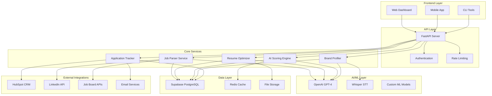

# 🏗️ System Architecture

## Overview

The Job Search Automation Platform is built on a modern, scalable architecture that leverages AI, cloud databases, and enterprise integrations to create an intelligent job search ecosystem.

## High-Level Architecture



## Core Components

### 1. Job Parser Service
**Purpose**: Ingests and normalizes job data from multiple sources

**Key Features**:
- Multi-source job scraping (LinkedIn, Indeed, company websites)
- Job description parsing and normalization
- Duplicate detection and deduplication
- Company enrichment and classification

**Technology Stack**:
- Python with BeautifulSoup/Scrapy for web scraping
- OpenAI GPT for content extraction and normalization
- Supabase for data persistence

### 2. Resume Optimizer
**Purpose**: Intelligently tailors resumes to specific job requirements

**Key Features**:
- Multi-version resume management
- AI-powered bullet point optimization
- Keyword matching and scoring
- Format-agnostic resume processing

**Technology Stack**:
- Python with docx/pdf processing libraries
- OpenAI GPT for content optimization
- Template engine for resume generation

### 3. AI Scoring Engine
**Purpose**: Provides intelligent matching between jobs, resumes, and personal brand

**Key Features**:
- Job-to-resume fit scoring
- Company culture alignment scoring
- Personal brand compatibility assessment
- Explainable AI with detailed rationale

**Technology Stack**:
- OpenAI GPT-4 for natural language understanding
- Custom scoring algorithms
- Redis for caching frequent calculations

### 4. Brand Profiler
**Purpose**: Extracts and maintains user's professional identity and preferences

**Key Features**:
- Voice-driven intake interviews
- Structured profile generation
- Version control for profile evolution
- Dynamic recommendation engine

**Technology Stack**:
- Whisper/AssemblyAI for speech-to-text
- OpenAI GPT for conversation management
- Supabase for profile storage and versioning

### 5. Application Tracker
**Purpose**: Monitors and manages job application lifecycle

**Key Features**:
- Application status monitoring
- Email parsing for updates
- HubSpot CRM synchronization
- Automated follow-up scheduling

**Technology Stack**:
- IMAP/SMTP for email processing
- HubSpot API for CRM integration
- Celery for background task processing

## Data Architecture

### Database Schema

```sql
-- Core entities
CREATE TABLE companies (
    id UUID PRIMARY KEY DEFAULT gen_random_uuid(),
    name VARCHAR NOT NULL,
    domain VARCHAR UNIQUE,
    industry VARCHAR,
    employees INTEGER,
    created_at TIMESTAMP DEFAULT NOW()
);

CREATE TABLE jobs (
    id UUID PRIMARY KEY DEFAULT gen_random_uuid(),
    company_id UUID REFERENCES companies(id),
    title VARCHAR NOT NULL,
    description TEXT,
    requirements TEXT,
    salary_min INTEGER,
    salary_max INTEGER,
    created_at TIMESTAMP DEFAULT NOW()
);

CREATE TABLE resumes (
    id UUID PRIMARY KEY DEFAULT gen_random_uuid(),
    user_id UUID NOT NULL,
    version VARCHAR NOT NULL,
    content JSONB,
    tags TEXT[],
    created_at TIMESTAMP DEFAULT NOW()
);

CREATE TABLE brand_profiles (
    id UUID PRIMARY KEY DEFAULT gen_random_uuid(),
    user_id UUID NOT NULL,
    version INTEGER DEFAULT 1,
    profile_data JSONB,
    created_at TIMESTAMP DEFAULT NOW()
);

CREATE TABLE job_scores (
    id UUID PRIMARY KEY DEFAULT gen_random_uuid(),
    job_id UUID REFERENCES jobs(id),
    resume_id UUID REFERENCES resumes(id),
    brand_profile_id UUID REFERENCES brand_profiles(id),
    score INTEGER CHECK (score >= 0 AND score <= 100),
    rationale TEXT,
    created_at TIMESTAMP DEFAULT NOW()
);
```

### Data Flow

1. **Job Ingestion**: Jobs scraped → Parsed → Normalized → Stored in Supabase
2. **Resume Processing**: Resume uploaded → Parsed → Versioned → Stored with metadata
3. **Scoring**: Job + Resume + Brand Profile → AI Processing → Score + Rationale → Cached
4. **Application Tracking**: Application submitted → Status monitored → HubSpot updated

## Security Architecture

### Authentication & Authorization
- JWT-based authentication
- Role-based access control (RBAC)
- API key management for external integrations
- Secure credential storage with environment variables

### Data Protection
- Encryption at rest (Supabase native encryption)
- Encryption in transit (TLS 1.3)
- PII data anonymization
- GDPR compliance measures

### API Security
- Rate limiting per user/endpoint
- Input validation and sanitization
- SQL injection prevention
- CORS configuration

## Scalability Considerations

### Horizontal Scaling
- Stateless service design
- Database connection pooling
- Redis for session management
- Load balancer ready architecture

### Performance Optimization
- Database indexing strategy
- Query optimization
- Caching layers (Redis)
- Async processing for heavy operations

### Monitoring & Observability
- Application performance monitoring (APM)
- Error tracking and alerting
- Database performance monitoring
- User analytics and usage tracking

## Deployment Architecture

### Development Environment
- Local development with Docker Compose
- Hot reloading for rapid development
- Local database with sample data
- Mock external API responses

### Staging Environment
- Kubernetes cluster deployment
- Automated testing pipeline
- Performance testing
- Security scanning

### Production Environment
- Multi-region deployment
- Auto-scaling based on demand
- Disaster recovery procedures
- Blue-green deployment strategy

## Integration Patterns

### External API Integration
- Circuit breaker pattern for resilience
- Retry logic with exponential backoff
- API versioning strategy
- Webhook handling for real-time updates

### Event-Driven Architecture
- Message queues for async processing
- Event sourcing for audit trails
- CQRS pattern for read/write separation
- Saga pattern for distributed transactions

## Future Architecture Considerations

### Microservices Migration
- Service decomposition strategy
- API gateway implementation
- Service mesh for communication
- Distributed tracing

### AI/ML Pipeline Enhancement
- Model versioning and deployment
- A/B testing for AI features
- Real-time model inference
- Feedback loop for model improvement

### Mobile Architecture
- React Native for cross-platform development
- Offline-first data synchronization
- Push notification system
- Mobile-specific API optimizations
